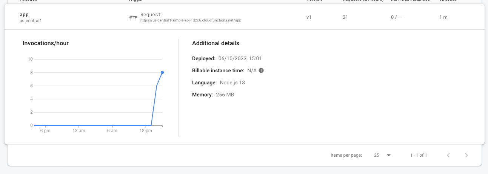

# Simple API

This API provides a simple service to replace specific words in a given sentence with their corresponding values from a dictionary. It also preserves the case sensitivity of words that do not match any dictionary entries.

## Endpoint
POST /
This endpoint accepts a JSON payload with raw body of a sentence and returns a modified sentence with word replacements based on a predefined dictionary. The case of non-dictionary words will be preserved.

**Request Example**
```json
POST https://us-central1-simple-api-1d2c6.cloudfunctions.net/app
Content-Type: application/json

Body: "AbN and ING are two popular banks in the Netherlands."
```

**Response Example**
```json
{
    "result": "ABN AMRO and ING Bank are two popular banks in the Netherlands."
}
```

## Hosting

Due to simplicity of the solution requirements for hosting, I chose to use [Google Firebase Functions](https://firebase.google.com/docs/functions) service. It allows to quickly deploy AWS Lambda equivalent functions with dedicated URLs. I chose to create and deploy the solution using Firebase CLI which creates a sample project directory configuration, locally emulate the solution for debugging, and deploy with 1 command to the cloud.

## Postman Testing

In the `/postman-tests` folder you can find a [Postman](https://www.postman.com/downloads/) collection which can be imported to use for testing this API. The collection includes examples of sentences with lower, upper, and even mixed case keywords.

## Key Learnings
I really enjoyed the flexibility of this challenge, there are so many ways that such a simple solution can be implemented. I tried to focus on the leanest solution to achieve this challenge, I didn't want to add additional bloatware where it isn't needed. My additional goal was to refresh my JavaScript skills (turns out they're not so rusty) and to learn some new cloud technology - Firebase.
- Firebase is a very good tool for simple function development such as this example
  - Very quick to get started with
  - Repository initialization installs all files needed to start developing and options to customize
  - Limitation of language options out-of-the-box: Typescript, JavaScript, and Python
  - Like all cloud providers, you still need to provide a credit card to just play around with
  - Provides instant analytics, even for such a basic functionality
- Postman still serves as a great tool to test APIs and share tests


